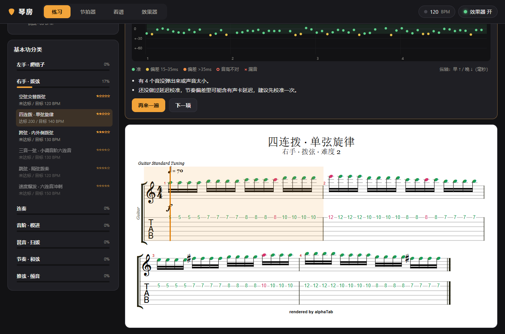
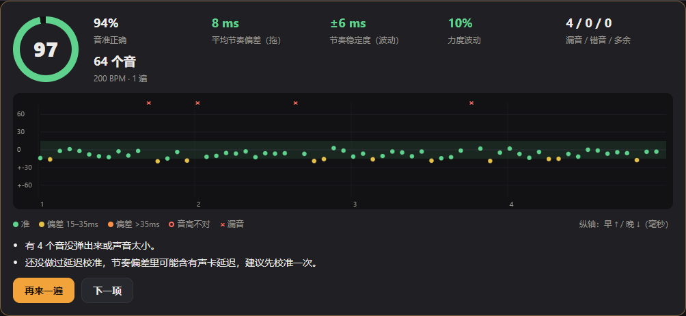
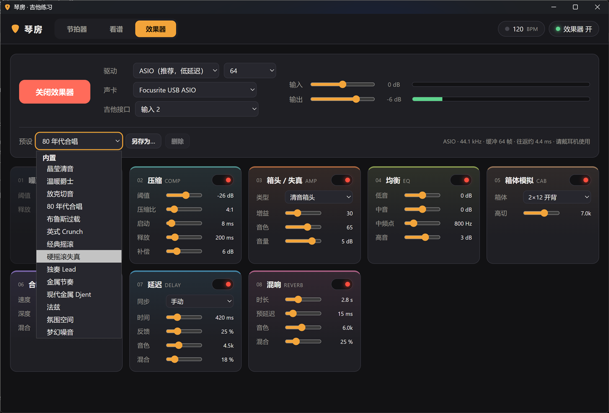

# 琴房 · 吉他练习

Windows 桌面吉他练习软件：基本功曲库 + 自适应练琴路线 + 演奏测评，外加节拍器、看谱和低延迟效果器。基于 [Tauri 2](https://tauri.app)，安装包约 5 MB。



## 功能

### 练习
- **基本功曲库**：26 条练习，分 7 类（左手爬格子、右手拨弦、连奏、音阶模进、琶音扫拨、节奏和弦、推弦颤音），难度 1–5 级，均为 Guitar Pro 7 文件（`src/library/*.gp`）。
- **自适应路线**：每条练习记录「弹干净（≥85 分）」的最高速度，按得分自动加速或回落；每日计划 = 热身 + 最弱的三个类别 + 一条高一级的挑战；当前等级 60% 的练习达标后自动升级。
- **演奏测评**（需桌面版 + 声卡）：按 ASIO 时钟打预备拍和节拍，同时录下吉他干声，弹完在本机分析：
  - 起音检测（对数频谱通量）+ 音高检测（YIN），连奏的击勾弦用音高跳变补检；
  - 与谱面做动态规划对齐，给出音准、节奏偏差（抢拍/拖拍）、稳定度、力度均匀度、漏音/错音/多余音、推弦音分偏差；
  - 逐音节奏偏差图，谱面按对错上色，附改进建议；
  - 「延迟校准」：跟着节拍弹 16 下空弦，扣除声卡和手感的固定延迟。



### 效果器
Rust 原生音频引擎（[cpal](https://github.com/RustAudio/cpal)），支持 **ASIO**（缓冲 64 帧时往返约 4 ms）和 WASAPI。
效果链：噪声门 → 压缩 → 箱头/失真（6 种类型，4 倍过采样）→ 三段均衡 → 箱体模拟 → 合唱 → 延迟（可跟节拍器同步）→ 混响 → 软限幅。内置 14 个音色预设，可另存自己的。



### 节拍器与看谱
- 节拍器：30–300 BPM、拍号与细分、逐拍重音/静音、敲击测速、渐进提速。
- 看谱：Guitar Pro（gp3–gp7）、MusicXML、alphaTex（由 [alphaTab](https://alphatab.net) 渲染并可播放）、PDF（[pdf.js](https://mozilla.github.io/pdf.js/)）、图片、文本六线谱；自动滚动、夜间谱面、翻页器/方向键翻页。

## 下载

在 [Releases](https://github.com/W1ght/qinfang/releases) 下载 `Qinfang_版本号_x64-setup.exe`（安装版）或 `Qinfang_版本号_x64-portable.exe`（免安装，需系统自带 WebView2，Windows 10/11 一般都有）。每次推送到 main 的构建产物也可以在 Actions 页面下载。

## 从源码构建

需要：Node.js 20+、Rust（MSVC 工具链）、Visual Studio Build Tools（C++）、[LLVM](https://releases.llvm.org/)（ASIO 绑定生成用 libclang）。

```bat
npm ci
rem 在「x64 Native Tools」命令行里（或先 call vcvarsall.bat amd64）
set LIBCLANG_PATH=C:\Program Files\LLVM\bin
set CLANG_PATH=C:\Program Files\LLVM\bin\clang.exe
npx tauri build
```

首次构建时 `asio-sys` 会自动下载 Steinberg ASIO SDK。产物在 `src-tauri/target/release/`，NSIS 安装包在 `bundle/nsis/`。

其他命令：

```sh
npm test          # 练习路线与测评打分的单元测试
npm run library   # 由 tools/build-library.mjs 重新生成练习曲库 (.gp)
cd src-tauri && cargo test --release   # DSP 与音频分析测试
```

前端在 `src/`，无需打包工具，也可以直接用任意静态服务器在浏览器里打开（此时效果器退回 Web Audio，测评不可用）。

## 发布新版本

1. 同步修改 `src-tauri/tauri.conf.json`、`src-tauri/Cargo.toml`、`package.json` 里的版本号并提交。
2. 推送同名标签：`git tag v0.2.0 && git push origin v0.2.0`。

GitHub Actions（`.github/workflows/build.yml`）会在 Windows 上跑测试、打包，并把安装包发布到 Releases。标签与版本号不一致时会失败。

## 许可证

本项目以 [MIT 许可证](LICENSE) 发布。第三方组件保留各自的许可证，见下表。

### 第三方组件

| 组件 | 许可证 |
| --- | --- |
| [alphaTab](https://github.com/CoderLine/alphaTab) | MPL-2.0 |
| [pdf.js](https://github.com/mozilla/pdf.js) | Apache-2.0 |
| Bravura 字体 | SIL OFL 1.1 |
| Sonivox 音色库 | Apache-2.0 |
| ASIO SDK（构建时下载） | Steinberg 许可 |

各组件的许可证文本见 `src/vendor/`。ASIO 是 Steinberg Media Technologies GmbH 的商标。
